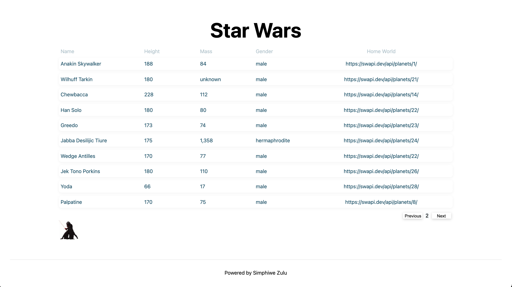
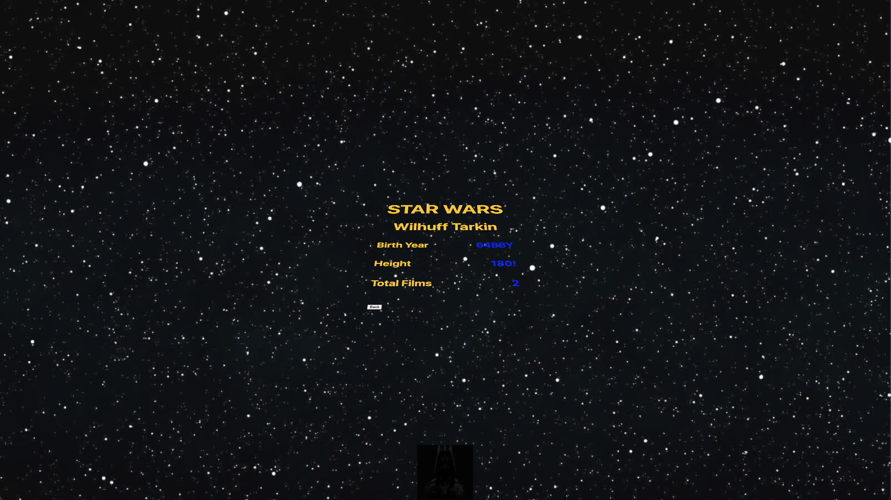

# MagicTheGathering

This is a [Next.js](https://nextjs.org/), [GraphQl](https://graphql.org/) and `Typescript` project. It shows different people/characters and their information from the well loved movie series `Star Wars`.

Below is how to get the project running on your system, this assumes you already have `nodejs/npm` and a text editor of your choice installed.


## Getting Started

First, run the development server:

```bash
npm run dev
# or
yarn dev
```

Open [http://localhost:3000](http://localhost:3000) with your browser to see the result.

Once ran succefully you can then alternatively run the below command to build the project for production and run it:

```bash
npm run build && npm run start
```


`There are two main pages :`
### Characters List Page



The above page shows a pagonated list of characters, which whom if you click on will take you to the characters page with their details

### Character Details Page



Which shows information of the characters along with a button to go back to previous list page.

`Live Demo:` [https://starwarsgraphql.vercel.app/](https://starwarsgraphql.vercel.app/)
